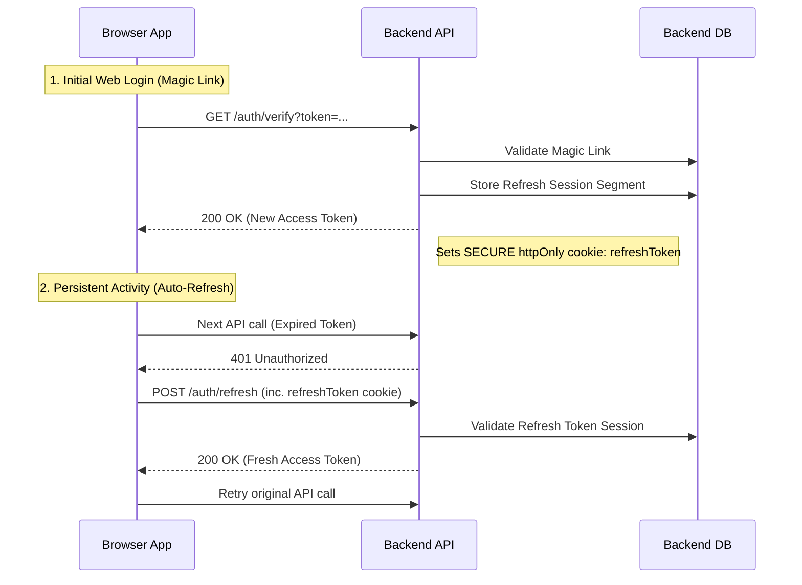

# PNS Web

PNS Web is the frontend web application for the PNS online ordering and product catalog system. Explore various snack options, add to your cart, pay seamlessly via QRIS, and pick up your items at the nearest PNS outlet!

## 🚀 Features

- **Product Catalog**: Browse through a variety of snacks, top-selling categories, and promotional packages.
- **Easy Ordering Process**: A streamlined 3-step ordering process: 
  1. Choose snacks.
  2. Pay via QRIS instantly.
  3. Pick up at the nearest store.
- **Responsive Layout**: Designed to be rich, visually appealing, and work seamlessly on mobile, tablet, and desktop devices.
- **WhatsApp Integration**: Fast customer support via a floating WhatsApp button for quick inquiries.
- **Admin Dashboard**: Comprehensive dashboard for managing products, suppliers, and purchase history.
- **Purchase Management**: Streamlined "Kulakan Barang" flow with draft saving, real-time HPP impact analysis, and safe deletion of draft records.
- **Best-Practice Auth**: Secure session management using Access + Refresh tokens with auto-interception and silent renewal.

## 🛠 Tech Stack

- **Framework:** Next.js 16.2.0 (App Router paradigm)
- **Language:** TypeScript 5.x (Strict Mode)
- **UI Library:** React 19
- **Styling:** Tailwind CSS v4
- **Components:** shadcn/ui & lucide-react
- **Package Manager:** Bun

## 📦 Getting Started

### Prerequisites

Ensure you have [Bun](https://bun.sh/) installed locally.

### Installation

1. From the project root, install all dependencies:
   ```bash
   bun install
   ```

### Running the Development Server

Start the application locally:

```bash
bun dev
```

Open [http://localhost:3000](http://localhost:3000) with your browser to see the result. The page will auto-update as you edit files in the `src/` directory.

## 📐 Project Structure

- `src/app/`: Handles Next.js routing, nested layouts, and page-level data fetching.
- `src/components/ui/`: Atomic, highly reusable UI primitives (includes `shadcn/ui` components).
- `src/components/`: Domain-specific components composing the app views, such as `Navbar`, `Hero`, `HowToOrder`, `Wholesale`, and `Categories`.
- `src/lib/`: Reusable utility functions like `cn()` tailwind merger.
- `public/`: General static assets like fonts, icons, and logos.

## Authentication Architecture

To ensure high security without compromising user experience, the system uses a **Dual-Token Strategy**:

1.  **Access Token (JWT)**:
    *   **Lifetime**: 15 minutes.
    *   **Storage**: `localStorage` (via `auth_token` key).
    *   **Usage**: Sent as a Bearer token in the `Authorization` header for all protected API requests.

2.  **Refresh Token (JWT/Cookie)**:
    *   **Lifetime**: 7 days.
    *   **Storage**: **`httpOnly` Secure Cookie**. JavaScript cannot access this token, making it highly secure against XSS.
    *   **Usage**: Stored in the backend database. Used by the browser automatically to silently request new access tokens when they expire.

### Silent Renewal Flow

When an API call returns a **401 Unauthorized**, the application's global API client automatically intercepts the error, calls the `/auth/refresh` endpoint to get a fresh access token, and then retries the original request seamlessly.


